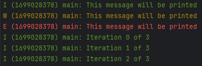

# LOGL — A simple logging library
The logging system is designed to make log and debug messages clearer and improve their uniformity across your project.
It makes it easier to see where a log message comes from and what its severity is.

To use the logging system, include `logl.h` in your source file, and use the following macros to print log messages:
```c
LOG_DEBUG(TAG, fmt, ...)
LOG_INFO(TAG, fmt, ...)
LOG_WARN(TAG, fmt, ...)
LOG_ERROR(TAG, fmt, ...)
```
The same format specifiers as in `printf` can be used.

The `TAG` parameter is a string that identifies the source of the log message.
It is recommended to use one tag for each source file / module, and to name the tag after the source file / module.
See the example below.

### Global Log Level
You can control the verbosity of the logging output by setting a global log level in `logl.h`.
This log level filters out messages with a lower priority.

### Custom Log Levels
Additionally, you have the flexibility to override the log level for individual tags (but not lower than the global log level).
This can be archived by calling the following function:
```c
logl_set_level(LOG_TAG, LOG_LEVEL);
```
If the log level for a tag is not set, the global log level is used.

### Colorful Log Messages
For improved readability, log messages can be printed in color by configuring `LOGL_USE_COLOR` to `1` in `logl.h`.

### Log Output Format
Each log entry is formatted to include the following information:

- Log level (D for Debug, I for Info, W for Warning, E for Error)
- Timestamp
- Tag
- The log message

For instance, a log entry may look like this:

`I (1699027376) LTDC: This is a log message`

### Example
```c
#include "logl.h"

// Don't use a define for the tag, as the pointer to the tag is used
static const char* TAG = "main";

int main() {
    // Set the log level for the main tag to INFO
    logl_set_level(TAG, LOG_LEVEL_INFO);

    LOG_DEBUG(TAG, "This message will not be printed");
    LOG_INFO(TAG, "This message will be printed");
    LOG_WARN(TAG, "This message will be printed");
    LOG_ERROR(TAG, "This message will be printed");

    // The same format specifiers as in printf can be used
    for (int i = 0; i < 3; i++) {
        LOG_INFO(TAG, "Iteration %d of %d", i, 3);
    }
    return 0;
}
```
Result:
```
I (1699028378) main: This message will be printed
W (1699028378) main: This message will be printed
E (1699028378) main: This message will be printed
I (1699028378) main: Iteration 0 of 3
I (1699028378) main: Iteration 1 of 3
I (1699028378) main: Iteration 2 of 3
```
With `LOGL_USE_COLOR` set to `1`:


